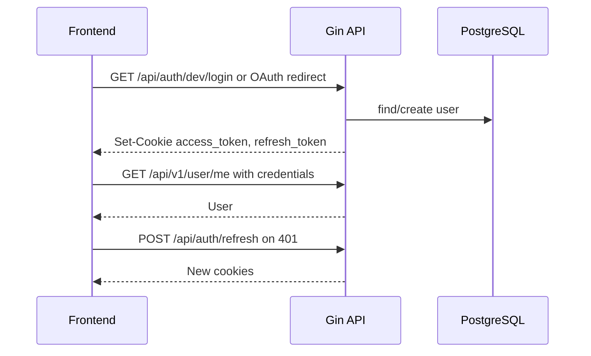
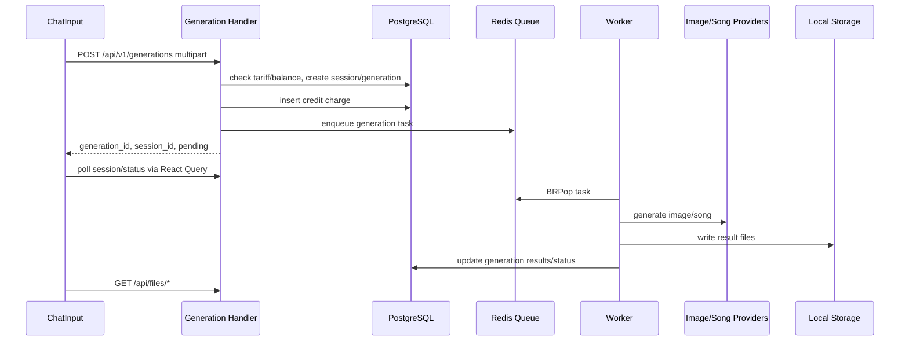

# FunBaza Project Audit

Дата аудита: 2026-04-29

## Scope

Аудит выполнен по текущему состоянию репозитория `present generator`.

Использованные источники:

- Serena: активация проекта, onboarding, обзор Go-символов.
- filesystem: структура проекта, package/config/source/docs файлы.
- Context7: актуальные рекомендации по `/reactjs/react.dev`, `/tanstack/query`, `/websites/gin-gonic_en`.

Исходный код не изменялся. Создан этот отчет; Serena также использует служебные проектные данные для onboarding.

## Краткая Карта Проекта

```text
present generator/
+-- package.json                 # root scripts: infra/back/front/dev/build
+-- Dockerfile                   # production multi-stage build: frontend + Go backend
+-- docker-compose.yml           # production-like app + postgres + redis
+-- docs/                        # продуктовая и техническая документация
+-- backend/
|   +-- cmd/server/main.go        # composition root: config, DB, Redis, routes, worker
|   +-- cmd/sunotest/             # integration utility
|   +-- internal/
|   |   +-- config/               # env config
|   |   +-- handlers/             # auth, billing, generation, session, webhook
|   |   +-- middleware/           # logger, recovery, cookie auth
|   |   +-- models/               # domain structs and constants
|   |   +-- repository/           # SQL repositories and migrations runner
|   |   +-- services/             # billing, JWT, storage, image/song providers
|   |   +-- worker/               # Redis queue, worker, webhook task store
|   +-- migrations/               # SQL migrations
+-- frontend/
    +-- package.json              # Vite/React scripts and deps
    +-- vite.config.ts            # React + Tailwind v4 + /api proxy
    +-- src/
        +-- App.tsx               # QueryClientProvider + auth gate
        +-- main.tsx              # React StrictMode root
        +-- components/           # chat, sidebar, transactions, UI primitives
        +-- hooks/                # React Query hooks
        +-- lib/                  # API client, types, theme, utils
        +-- pages/                # LoginPage, ChatPage
```

## Стек

| Область | Фактический стек |
|---|---|
| Backend framework | Go `1.25.0`, Gin `v1.12.0` |
| Backend data | PostgreSQL через `database/sql` + `lib/pq`; Redis через `go-redis/v9` |
| Auth | JWT `golang-jwt/jwt/v5`, httpOnly cookies |
| Queue/worker | Redis list `LPush` + `BRPop`, in-process workers |
| Migrations | `golang-migrate/migrate/v4`, авто-прогон при старте backend |
| API docs | `swaggo/gin-swagger`, generated docs in `backend/docs/` |
| Frontend framework | React `19.2.x`, Vite `8.x`, TypeScript `6.x` |
| Router | Нет фактического router; условный auth gate в `App.tsx` |
| Server state | `@tanstack/react-query` v5 |
| Client/UI state | `useState`, Context for theme, `localStorage` |
| UI-kit | Самописные primitives + inline styles + lucide-react icons |
| Styling | Tailwind CSS v4 import/plugin, CSS variables, inline styles |
| Forms/validation | Без form library; ручное состояние и ручная валидация |
| Frontend tests | Не настроены |
| Backend tests | `*_test.go` не найдены |

## Архитектурная Схема

```mermaid
flowchart TB
  User[User Browser] --> FE[Vite/React UI]
  FE -->|/api proxy in dev, same origin in prod| Gin[Go Gin API]

  Gin --> Auth[Auth Handler + JWT cookies]
  Gin --> Billing[Billing Handler/Service]
  Gin --> Generation[Generation Handler]
  Gin --> Sessions[Session Handler]
  Gin --> Webhooks[Webhook Handler]

  Billing --> BillingRepo[Billing Repository]
  Generation --> GenRepo[Generation Repository]
  Generation --> SessionRepo[Session Repository]
  Sessions --> SessionRepo
  Auth --> UserRepo[User Repository]

  UserRepo --> PG[(PostgreSQL)]
  BillingRepo --> PG
  GenRepo --> PG
  SessionRepo --> PG

  Generation --> Queue[Redis Queue]
  Worker[In-process Worker] --> Queue
  Worker --> ImageProvider[Mock/KIE Image Provider]
  Worker --> SongProvider[Mock/Suno Provider]
  Worker --> Storage[Local Storage]
  Worker --> PG
  Webhooks --> Redis[(Redis)]
  Queue --> Redis

  Storage --> Files[/api/files/*]
  Gin --> Files
```

## Схема Потоков Данных

### Auth



### Generation



## Context7 Сверка

### React

Context7 по официальной React-документации подтвердил:

- `StrictMode` в корне приложения корректен; он помогает ловить проблемы эффектов в dev. В проекте используется в `frontend/src/main.tsx:7`.
- Context подходит для UI-состояния вроде темы. В проекте `ThemeProvider` использует Context в `frontend/src/lib/theme.tsx:12`.
- Эффекты стоит держать минимальными и чистыми. В `frontend/src/lib/theme.tsx:81-82` есть два эффекта, оба вызывают `applyTheme`; второй mount-only эффект выглядит лишним.

### TanStack Query

Context7 по TanStack Query v5 подтвердил:

- `QueryClientProvider` на верхнем уровне соответствует рекомендации; см. `frontend/src/App.tsx:8` и `frontend/src/App.tsx:37`.
- Использование object API для `invalidateQueries/removeQueries` соответствует v5; см. `frontend/src/hooks/useAuth.ts:22-23`, `frontend/src/hooks/useSessions.ts:35`.
- Server state отделен от local UI state в целом правильно.
- Polling через `refetchInterval` допустим, но `500ms` для audio + `refetchIntervalInBackground: true` в `frontend/src/hooks/useSessions.ts:17-24` может быть дорогим для API и батареи.

### Gin

Context7 по Gin подтвердил:

- `gin.New()` + global middleware + route groups соответствует типичному паттерну; см. `backend/cmd/server/main.go:134-158`.
- Для JSON body рекомендуется binding/validation tags. В проекте это частично есть для lyrics prompt (`backend/internal/handlers/generation.go:490`, `:520`), но multipart creation в основном валидируется вручную.
- При раздаче файлов нужно явно учитывать path traversal. Текущий `/api/files/*key` строит путь через `filepath.Join` без проверки выхода за `STORAGE_LOCAL_DIR`; см. `backend/cmd/server/main.go:180-182`.

## Что Хорошо

- Backend composition root понятен: config, DB, Redis, storage, repos, services, handlers, worker собираются в `main.go`.
- Слои backend разделены здраво: handlers -> services -> repositories.
- Graceful shutdown для HTTP-сервера есть (`backend/cmd/server/main.go:219-231`).
- React Query выбран правильно для server state; cache invalidation после мутаций уже используется.
- SQL migrations лежат в репозитории и автоматически применяются при старте.
- Dev/prod Docker story уже набросан: local infra отдельно, production image собирает фронт и backend.

## Критические Риски

| Severity | Риск | Где видно | Почему важно |
|---|---|---|---|
| Critical | Frontend API client строит неверные URL | `frontend/src/lib/api.ts:6`, `:52-73`; backend routes `backend/cmd/server/main.go:157-177` | `request()` уже добавляет `/api/v1`, но методы часто передают путь с `/api/v1`. Получаются URL вроде `/api/v1/api/v1/user/me`. Auth/dev login также превращается в `/api/v1/api/auth/dev/login`. |
| Critical | Dev login доступен в production route table | `backend/cmd/server/main.go:152`, `backend/internal/handlers/auth.go:60-87` | Комментарий говорит "только development", но route не gated по `APP_ENV`. В production это может дать любой учетке вход без OAuth. |
| Critical | Path traversal в local file serving/storage | `backend/cmd/server/main.go:180-182`, `backend/internal/services/storage.go:33`, `:51`, `:55` | `filepath.Join(base, userKey)` без проверки containment позволяет запросами вида `../` попытаться читать файлы вне storage root. |
| High | OAuth-кнопки ведут на несуществующие backend routes | `frontend/src/pages/LoginPage.tsx:48`, `:56`; routes только `backend/cmd/server/main.go:152-154` | UI обещает Google/VK login, но backend регистрирует только dev login, refresh, logout. |
| High | Cookie security не соответствует собственной документации | `backend/internal/handlers/auth.go:163-170`; docs `docs/FunBaza_Auth_Cookies.md:42-43` | Cookies выставляются `Secure=false`, без `SameSite=None`, без `Partitioned`, без CSRF. Для Telegram Mini App и production это не готово. |
| High | Race condition в списании кредитов | `backend/internal/repository/billing.go:52-78` | Баланс считается `SUM(amount)` внутри транзакции без row/advisory lock или ledger balance row. Параллельные списания могут уйти в минус. |
| High | `package.json` и `package-lock.json` рассинхронизированы | `frontend/package.json:12-20`, `frontend/package-lock.json:10-18`, `Dockerfile:4-5` | Lock содержит `react-router-dom`, manifest нет. `npm ci` в Dockerfile чувствителен к расхождению manifest/lock и может ломать production build. |
| Medium | Docs по API устарели относительно `/api/v1` | `docs/04_FunBaza_DevStatus.md:66-92`, routes `backend/cmd/server/main.go:157-177` | Документация описывает `/api/user/me`, `/api/billing/*`, `/api/generations/*`, а фактический backend использует `/api/v1/*`. |
| Medium | Lyrics endpoint на фронте без `/api/v1` | `frontend/src/components/ChatInput.tsx:95`, backend `backend/cmd/server/main.go:171` | Генерация текста песни обращается к `/api/generations/lyrics`, но route зарегистрирован как `/api/v1/generations/lyrics`. |
| Medium | Polling может перегружать API | `frontend/src/hooks/useSessions.ts:17-24` | Фоновый refetch каждые `500ms` для audio плохо масштабируется. |
| Medium | Нет автоматических тестов | поиск `*_test.go`, `*.test.*`, `*.spec.*` не дал результатов | Высокий риск регрессий в auth, billing, worker и API client. |

## Устаревшие Или Сомнительные Решения

- `react-router-dom` присутствует в lock-файле, но отсутствует в `frontend/package.json`, а фактического роутинга нет.
- `frontend/src/App.css` содержит остатки Vite/template styles и не импортируется текущим `App.tsx`.
- В `backend/go.mod` все зависимости помечены `// indirect`, включая реально используемые Gin, JWT, Redis, migrate, Swagger. Это признак нетидированного module file.
- `STORAGE_MODE=r2` описан в env templates, но server startup завершает процесс для любого режима кроме local (`backend/cmd/server/main.go:88`).
- Swagger/docs выглядят частично сгенерированными по старым путям: annotations в auth указывают `/auth/dev/login`, а реальные routes под `/api/auth`.
- `GenerateLyrics` списывает кредиты с `uuid.New()` и при ошибке возвращает refund с другим `uuid.New()` (`backend/internal/handlers/generation.go:545`, `:554`), что ухудшает трассировку транзакций.
- Multipart validation в handler делает базовые проверки расширений, но не проверяет MIME/content sniffing.
- Worker использует Redis list без visibility timeout/dead-letter semantics; при падении процесса во время задачи task может потеряться после `BRPop`.

## Приоритетный План Улучшений

### P0: Вернуть базовую работоспособность и закрыть явные security holes

1. Исправить API client contract:
   - `request('/user/me')` должен давать `/api/v1/user/me`.
   - Auth endpoints должны либо обходить `/api/v1`, либо иметь отдельный `authRequest`.
   - Lyrics fetch перевести на `/api/v1/generations/lyrics`.
2. Закрыть dev login:
   - регистрировать `/api/auth/dev/login` только при `APP_ENV=development`;
   - либо добавить runtime guard в `DevLogin`.
3. Защитить local file serving/storage:
   - нормализовать key;
   - запретить absolute paths и `..`;
   - проверять, что resolved path остается внутри storage root.
4. Синхронизировать `frontend/package.json` и `package-lock.json`; после этого проверить `npm ci`.

### P1: Auth и billing production readiness

1. Реализовать реальные OAuth routes или убрать/загейтить кнопки Google/VK до готовности.
2. Привести cookie policy к окружениям:
   - dev: безопасный localhost-compatible режим;
   - prod/TMA: `Secure`, `SameSite=None`, `Partitioned` при необходимости.
3. Добавить CSRF защиту для cookie-based state-changing requests.
4. Починить конкурентное списание кредитов:
   - balance row with `SELECT ... FOR UPDATE`, или
   - advisory lock per user, или
   - атомарная операция с материализованным балансом.
5. Добавить refresh-token rotation/blacklist, если auth должен быть production-grade.

### P2: Контракты, тесты, наблюдаемость

1. Ввести contract tests для API paths:
   - frontend client vs Gin routes;
   - auth refresh/retry.
2. Добавить backend unit/integration tests:
   - billing race and refund;
   - auth middleware/cookies;
   - generation create validation;
   - storage path containment.
3. Добавить frontend tests для `api.ts` и ключевых hooks.
4. Обновить Swagger/docs под фактический `/api/v1`.
5. Добавить structured request IDs/correlation IDs для worker/generation flow.

### P3: Архитектурная чистка и масштабирование

1. Вынести route registration из `main.go` в отдельный модуль, чтобы `main.go` остался composition root.
2. Принять решение по frontend router:
   - либо добавить `react-router-dom` и реальные routes,
   - либо удалить из lock и оставить single-screen app.
3. Заменить Redis list queue на схему с visibility timeout/retry/dead-letter или готовую очередь.
4. Реализовать R2/S3 storage adapter или убрать недоступный режим из env templates.
5. Снизить polling: exponential backoff, server-sent events, websocket или webhook-to-client notification позже.

## Команды Для Проверки После Исправлений

```bash
npm run infra
npm run back
npm run front
cd frontend && npm run lint
npm run build
cd backend && go test ./...
```

На момент аудита эти команды не запускались: задача была аналитической, без правок кода и без изменения build artifacts.
